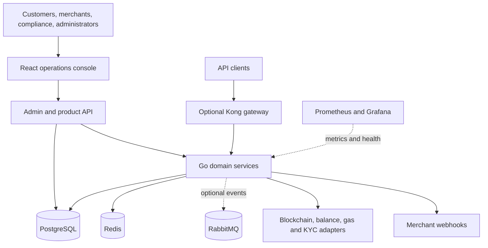

# DePay — Portfolio Case Study

## 1. Project Summary

**Project name:** DePay  
**Project type:** Crypto payment operations platform — public pilot component  
**Main technologies:** Go, Gin, PostgreSQL, React, TypeScript, Redis, RabbitMQ, Docker, Kubernetes, Prometheus, Grafana  
**Role:** Backend & DevOps Engineer

DePay is the public pilot component of a startup platform for accepting cryptocurrency payments through specialized payment terminals. The implementation combines service-based Go APIs, a PostgreSQL domain and analytics layer, external-provider adapters, and a React operations console. It covers invoices, wallets, transaction validation and status progression, webhook delivery, KYC/risk workflows, and operational visibility.

## 2. Portfolio Case Study

## Project Overview

| Field | Repository-supported description |
|---|---|
| **Project type** | Crypto payment operations platform; public pilot component |
| **Industry/domain** | Fintech / digital-asset payments |
| **Platform** | Web, REST API, backend services, data platform, infrastructure |
| **Developer role** | Backend & DevOps Engineer |
| **Client/company** | Confidential Startup |
| **Public attribution** | Previous work by an Oferli technical team member |

The developer confirmed that the `DePay` name, prepared UI screenshots, approved Figma collateral, high-level architecture, and technical contribution may be published. The startup/client identity remains confidential.

## The Problem

A specialized crypto payment terminal must coordinate a set of connected operational workflows: issue merchant invoices, associate transactions with users and wallets, validate requests, track a controlled transaction lifecycle, update merchant-facing payment state, notify downstream systems, and give compliance and operations teams enough visibility to act.

DePay addresses this coordination problem with one pilot platform connecting the terminal payment experience to merchant, compliance, and operational systems.

The project remained at pilot stage. The developer confirmed that the pilot tested real cryptocurrency transactions; no production-scale, geographic, adoption, or commercial claims are made.

## The Solution

The repository implements eight Go backend services plus a shared Go module:

- `user-service` for accounts, profiles, KYC state, login, refresh rotation, and logout
- `merchant-service` for merchant identity, verification, invoices, terminals, webhooks, and API keys
- `wallet-service` for wallets and asset balances
- `transaction-core-service` for transaction initiation and lifecycle progression
- `transaction-validation-service` for transaction, ownership, balance, compliance, and risk checks
- `gas-info-service` for gas information and history
- `kyc-service` for local or configured provider-based KYC processing
- `admin-service` for allowlisted operational data, SQL analytics, service health, and the pilot flow

PostgreSQL stores users, stores, wallets, balances, invoices, terminal/NFC sessions, payment transactions, KYC and merchant-verification records, risk and blacklist data, audit logs, RPC observations, webhooks, delivery attempts, and merchant API keys. The schema includes migrations, indexes, roles, analytical functions, views, and triggers that enforce selected business invariants.

The React/TypeScript console provides role-specific workspaces for users, merchants, compliance operators, and platform administrators. Redis is used by wallet/gas paths, RabbitMQ is an optional transaction-event path, and external services are reached through configurable provider adapters. Docker Compose supports local profiles; Kubernetes, Kong, Vault, Prometheus, and Grafana configurations are also present.

## Main Features

- User authentication with access/refresh tokens, refresh rotation, revocation, and password hashing
- Role and database permission structures for user, merchant, compliance, and administrator concerns
- Merchant onboarding and verification state
- Wallet and multi-asset balance views
- Merchant invoices, invoice items, terminals, and NFC-style sessions
- Controlled transaction lifecycle with idempotency and terminal-state protection
- Transaction validation across format, ownership, balance, KYC, merchant status, blacklist, and risk conditions
- Optional EVM-compatible JSON-RPC broadcast and deterministic local broadcast mode
- Merchant webhooks with signing, attempts, retry scheduling, response logging, and dead-letter state
- Scoped merchant API keys whose raw value is returned only on creation
- KYC queues, merchant verification, risk alerts, blacklisted wallets, and audit records
- Merchant, user, compliance, and administrator dashboards
- SQL analytics functions, operational table viewer, and allowlisted function runner
- Health endpoints, Prometheus metrics, request IDs, structured logs, and Grafana dashboard configuration

## Technical Architecture

### High-level description

1. Users operate through the React console; API clients can use service endpoints through an optional gateway.
2. The web console reads operational and analytical data through the admin/product API.
3. Go services separate user, merchant, wallet, transaction, validation, gas, KYC, and admin responsibilities.
4. PostgreSQL is the source of truth for business and audit state.
5. Redis supports cache/history paths; RabbitMQ is an optional event transport.
6. Provider adapters connect to blockchain RPC, balance, gas, KYC, and merchant webhook systems when configured; local modes keep the pilot deterministic.
7. Prometheus scrapes service/infrastructure telemetry and Grafana provisions an overview dashboard.

### Deployment and CI/CD

- Dockerfiles exist for all eight backend services and the web app.
- Docker Compose provides base, backend, web, gateway, observability, and secrets profiles.
- Kubernetes manifests cover application services and supporting components.
- GitHub Actions run Go module tests, web tests/build, SQL tests, image builds, a Compose health smoke test, and offline Kubernetes manifest validation.
- No repository evidence of an automated production deployment job was found.

## Tech Stack

### Frontend

- React 18
- TypeScript
- Vite
- TanStack Query
- Recharts
- Lucide React

### Mobile / companion interface

- No mobile application found in the public repository
- Separately supplied Figma designs for a wallet/terminal companion interface; treated as approved design collateral rather than implemented source

### Backend

- Go 1.24
- Gin
- Viper
- Zap
- JWT
- bcrypt through `golang.org/x/crypto`

### Database

- PostgreSQL 13
- `golang-migrate`
- SQL functions, triggers, views, indexes, and database roles

### Infrastructure

- Docker and Docker Compose
- Kubernetes manifests
- Kong declarative gateway configuration
- Vault development/bootstrap configuration
- Redis
- RabbitMQ

### CI/CD

- GitHub Actions CI
- No automated production deployment was verified

### Testing

- Go standard testing and Testify
- Vitest and Testing Library
- Three SQL verification suites
- Compose smoke checks

### Monitoring

- Prometheus
- Grafana
- Per-service `/health` and `/metrics`
- Request IDs and structured Zap logging

### Integrations

- EVM-compatible JSON-RPC broadcast adapter
- Configurable balance and gas providers
- Configurable KYC provider
- Signed HTTP merchant webhooks

### Other

- Makefile orchestration
- OpenAPI/API documentation

## Technical Highlights

### 1. Transaction lifecycle protected at two layers

The service layer defines allowed transitions and idempotent repeat behavior, while a PostgreSQL trigger prevents invalid status progression at the data boundary. This matters because payment state can be changed by several execution paths and must remain consistent.

### 2. Confirmation updates downstream business state

The PostgreSQL-backed transaction path marks the related invoice as paid when a transaction is confirmed and creates terminal webhook delivery records. The integration test covers this combined outcome rather than validating only an isolated status field.

### 3. Webhook delivery is modeled as operational state

Webhook registration, supported events, signed payloads, attempts, response codes, next-attempt timestamps, and dead-lettering are represented explicitly. This makes failures observable and gives the system a basis for retries instead of treating callbacks as fire-and-forget.

### 4. Data integrity and compliance rules live close to the data

Database triggers validate wallet ownership and non-negative balances, create balance history and audit entries, set transaction completion timestamps, and generate selected high-risk-payment alerts. This protects invariants even when more than one service writes data.

### 5. External dependencies are replaceable at the boundary

Blockchain broadcast, balance lookup, gas data, KYC, and webhook delivery use configured provider modes with deterministic local behavior when a provider is absent. This makes local pilot verification reproducible while preserving integration points.

### 6. Operational access is allowlisted

The admin API exposes a fixed set of tables and SQL functions rather than arbitrary database execution. This reduces accidental exposure and keeps the console tied to reviewed operational capabilities.

### 7. CI validates multiple layers

The workflow covers Go modules, frontend behavior and production build, database migrations/functions/triggers/webhooks, container builds, a multi-service Compose smoke test, and Kubernetes YAML parsing. The checks are broader than a single unit-test job.

## Engineering Decisions

| Decision | Repository-supported or likely reason | Trade-off |
|---|---|---|
| Split domains into separate Go modules/services | The boundaries align with user, merchant, wallet, transaction, validation, gas, KYC, and administration responsibilities. **Reason should be confirmed with the original developer.** | Clear ownership and independent runtime boundaries, with additional orchestration and configuration overhead. |
| Use PostgreSQL as the source of truth | Repository documentation explicitly describes PostgreSQL as authoritative, and business rules are enforced through schema objects. | Strong consistency and rich analytics, but more business logic is coupled to PostgreSQL. |
| Keep in-memory repositories and deterministic provider modes | Tests and local pilot flows can run without live networks or vendors. **Reason should be confirmed with the original developer.** | Faster repeatable development, but behavior is not evidence of production-provider reliability. |
| Protect status and balance invariants with triggers | Prevents invalid state when writes come through different paths. | Better data integrity, with higher migration/testing complexity and logic split across Go and SQL. |
| Make RabbitMQ optional | The core flow can run without the broker while retaining an event-publication path. **Reason should be confirmed with the original developer.** | Easier local operation, but the event architecture is not consistently required end to end. |
| Use allowlists for admin tables/functions | Limits the operational console to known database surfaces. | Safer and easier to reason about, but every new admin capability requires code changes. |
| Use Compose profiles plus Kubernetes manifests | Supports incremental local stacks and a more deployment-oriented configuration. **Reason should be confirmed with the original developer.** | Flexible environments, with duplicated configuration that can drift. |

## Challenges

### Confirmed from repository

- Keeping invoice, transaction, audit, and webhook states consistent through the full payment lifecycle
- Making repeated transaction requests idempotent while protecting terminal states
- Validating payment requests across ownership, balance, KYC, merchant verification, blacklist, and risk data
- Coordinating eight backend services and supporting infrastructure in local and CI environments
- Providing useful dashboards and analytics from a normalized operational schema
- Handling external provider availability through explicit local and configured modes
- Tracking webhook failures and retry state in a way operators can inspect

### Likely / not publicly confirmed

- Which blockchain networks and assets were required by the original pilot
- Expected transaction volume, concurrency, and latency targets
- Regulatory or jurisdiction-specific compliance requirements
- How pilot transaction testing would translate into sustained production operation
- Which deployment target and operational constraints were used by the startup
- Whether webhook retries were operated by a background worker in another private component

## Developer Contribution

The developer worked as a **Backend & DevOps Engineer**. He confirmed that all three author-name variants in the repository history belong to him and that his contribution covered:

- Go backend architecture and implementation across the service modules
- PostgreSQL schema design, migrations, functions, triggers, roles, and analytics
- Transaction lifecycle, validation, and blockchain/provider integration paths
- Docker, Docker Compose, Kubernetes, gateway, and secrets-management configuration
- GitHub Actions CI, health checks, metrics, structured logging, Prometheus, and Grafana
- Work on the React operations console and its role-specific workflows

No separate code or design owner was identified by the developer. This case study still avoids claiming that Oferli originally built the product.

## Outcome

### Technical outcome

The repository provides a working local pilot across eight backend services, PostgreSQL, Redis, RabbitMQ, and the React console. During portfolio preparation:

- all Go module test commands completed successfully;
- 14 frontend tests passed and the production frontend build completed;
- all three SQL verification scripts completed after applying ten migrations;
- all eight service health endpoints returned ready;
- a local invoice moved to `paid`;
- its transaction moved to `confirmed`;
- the matching webhook delivery recorded `delivered`, one attempt, and a successful response code.

The local run used deterministic/synthetic data and non-production provider settings.

### Business outcome

The project remained at pilot stage and enabled the startup team to validate the complete operational path around a cryptocurrency payment through specialized terminals: merchant setup, invoice creation, wallet-linked payment, validation, confirmation, notification, compliance review, and reporting. The developer confirmed that real transactions were tested during the pilot. No public scale, adoption, revenue, or production-reliability metrics were supplied.

## 3. GitHub Portfolio Card

**Project:** DePay  
**Category:** Fintech / Crypto Payment Infrastructure  
**Stack:** Go, PostgreSQL, React, TypeScript, Redis, RabbitMQ, Docker, Kubernetes  
**Built:** A multi-service pilot platform for merchant invoicing, wallet-linked payments, validation, confirmation, webhooks, compliance, and operational analytics.  
**Key value:** Demonstrates the engineering of a traceable payment lifecycle across APIs, data integrity rules, provider integrations, and role-specific operations.  
**Case Study:** `[Add case study link]`

## 4. Visual Assets Checklist

| Visual | What it demonstrates | Prepared asset |
|---|---|---|
| Merchant dashboard after payment | Connects paid revenue, invoice state, terminal availability, and webhook success in one operational view. | `assets/screenshots/public/depay-merchant-dashboard.png` |
| Confirmed payment flow | Shows that an invoice and transaction complete with a confirmed terminal state. | `assets/screenshots/public/depay-payment-confirmed.png` |
| Webhook delivery | Shows signed-event operations through delivery status, attempts, and response handling using a sanitized `.test` URL. | `assets/screenshots/public/depay-webhook-delivery.png` |
| Merchant analytics | Shows invoice, transaction, revenue, and webhook summaries after the verified payment. | `assets/screenshots/public/depay-merchant-analytics.png` |
| Compliance risk alerts | Shows explicit operational review of detected risk conditions. | `assets/screenshots/public/depay-compliance-risk.png` |
| Admin analytics | Shows platform-wide transaction, failure, turnover, and RPC-health visualization. | `assets/screenshots/public/depay-admin-analytics.png` |
| SQL function runner | Demonstrates allowlisted database analytics without showing proprietary source code. | `assets/screenshots/public/depay-sql-function.png` |
| User transaction history | Shows role-specific transaction visibility including the locally confirmed payment. | `assets/screenshots/public/depay-user-transactions.png` |
| Role selector | Shows the four operational personas available in the console. | `assets/screenshots/public/depay-role-selection.png` |
| Figma wallet-rate design | Shows approved companion-interface design collateral without claiming a mobile implementation in the public source. | `assets/screenshots/public/depay-figma-wallet-rate.png` |

Do not publish the raw system-health screenshot because it displays internal container endpoint names. Do not add database-browser screenshots unless every row and connection detail has been sanitized.

## 5. Confidentiality and Security Review

### Safe to publish

- The high-level service architecture and domain responsibilities in this case study
- Technology names and repository-visible engineering practices
- The selected images under `assets/screenshots/public/`; all visible user/contact data is synthetic and uses reserved `.test` domains
- The approved Figma-derived USDT rate preview, explicitly labeled as design collateral
- The locally verified transaction outcome without transaction hashes, wallet keys, live endpoints, or customer identifiers
- High-level descriptions of authentication, data integrity, webhooks, provider adapters, CI, and observability
- Sanitized Mermaid diagrams without hostnames, account identifiers, IPs, or provider credentials

### Do not publish / verify first

- `server-config/jwt_private_key.pem` — private key material; do not publish or copy into the portfolio repository.
- `server-config/jwt_public_key.pem` — related key material; verify whether it may be retained or should be rotated/removed.
- `.env.example` — contains credential/configuration categories; never copy values into portfolio materials.
- Historical `API-Gateway/.env`, `api-gateway/.env`, `auth-terminal-service/.env`, and `user-service/.env` — environment files appear in Git history; verify that any historical credentials have been revoked and avoid republishing source history.
- `shared/config/config.go` and `shared/utils/utils.go` — contain development secret fallbacks; do not present them as production-safe configuration.
- `docker-compose.yml`, `docker-compose.images.yml`, `.github/workflows/ci-cd.yml`, `k8s/*.yaml`, and `server-config/setup_vault_and_kong.sh` — contain local credentials/default tokens or internal endpoint details; do not copy configuration values into the case study.
- `shared/middleware/cors.go` — requires review before any production reuse because the current policy combines a wildcard origin with credentialed requests.
- `apps/web/package-lock.json` — the current dependency audit reported four high-severity findings; remediate or explicitly accept them before reusing the application as a deployable public artifact.
- Original seed data, raw screenshots, database exports, logs, RPC responses, transaction hashes, wallet addresses, and webhook payloads — publish only sanitized synthetic examples.
- Startup/client name, unapproved design frames, real emails, and contributor personal email — keep confidential. The DePay name and selected Figma preview are approved for this case study.
- The source repository has no detected license — confirm ownership and publication rights before copying code or assets.
- Proprietary validation, risk, or payment-processing logic — describe at a high level; do not reproduce source code.

## Publication Decisions Confirmed by Mikhail

- Keep the startup/client identity confidential.
- The `DePay` name, prepared screenshots, approved Figma collateral, and high-level architecture may be published.
- Public role: Backend & DevOps Engineer.
- Contribution includes backend, database, blockchain integration, frontend, infrastructure, CI, and observability work.
- All three Git author-name variants belong to the developer.
- Product problem: cryptocurrency payments through specialized payment terminals.
- The project remained a pilot, and real transactions were tested.
- No separate code or design owner was identified.
- The Oferli portfolio repository should follow the same private-first approach as the previous case study.
