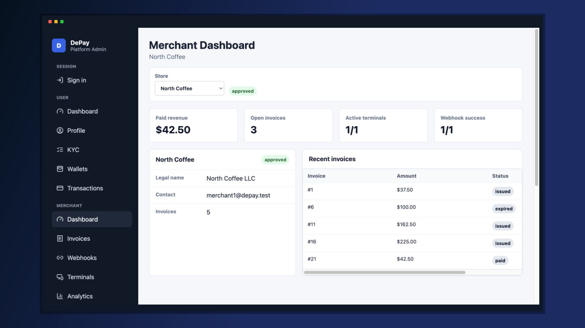
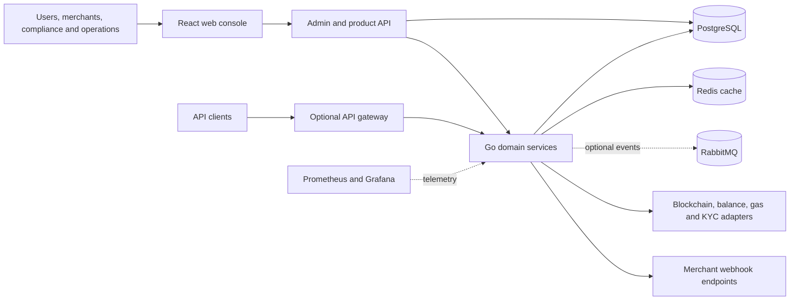
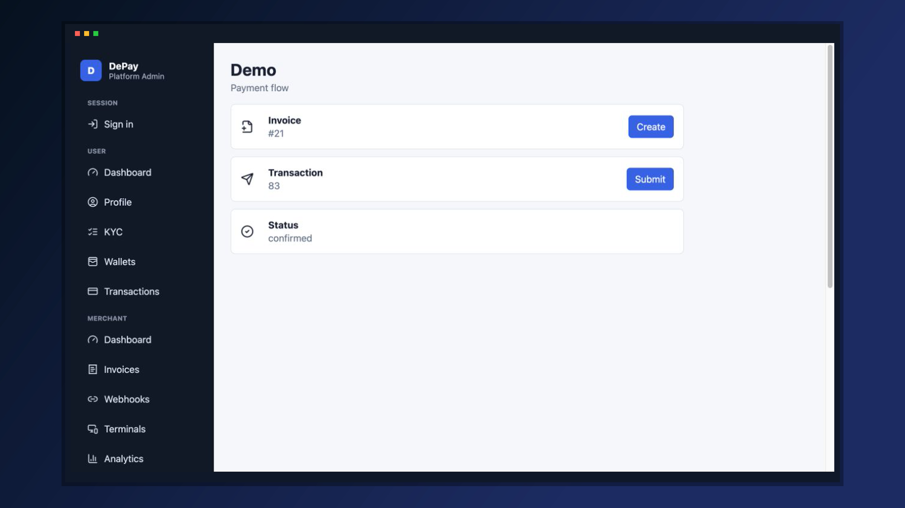
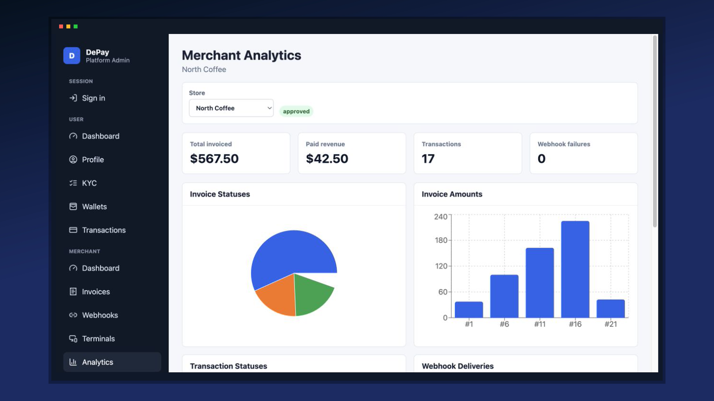
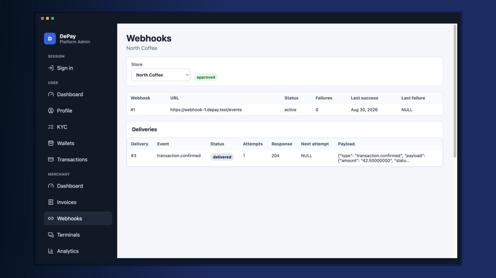
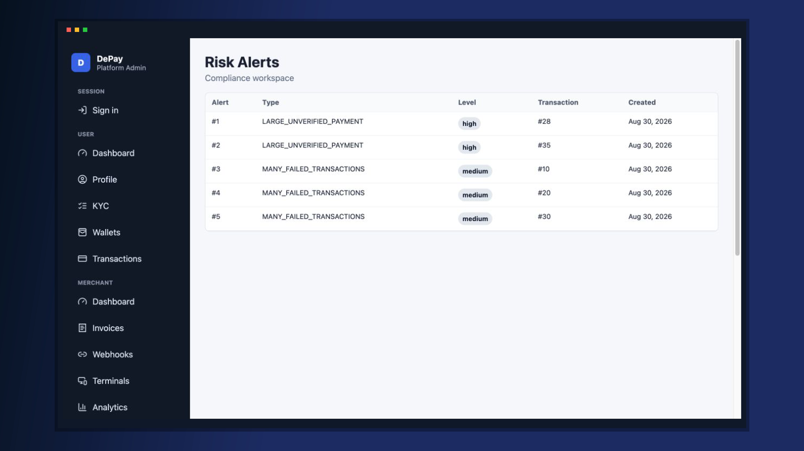
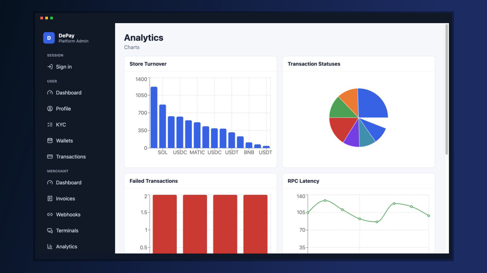
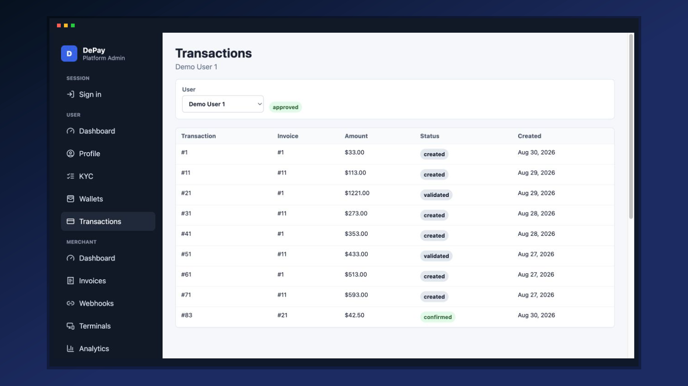
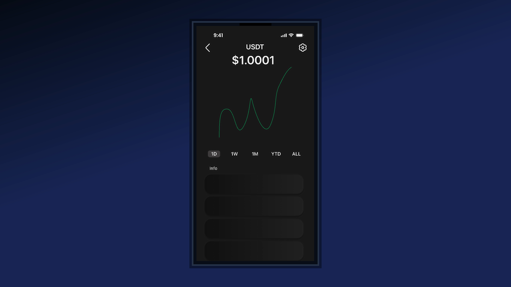

# DePay

**Crypto payment infrastructure pilot · Web console · REST APIs · Multi-service backend**

DePay is the public pilot component of a startup platform for accepting cryptocurrency payments through specialized payment terminals. It models the surrounding operational flow: merchant invoices, wallet-linked transactions, validation, blockchain broadcast adapters, confirmation, webhooks, KYC, risk review, and administrative oversight. The repository combines a Go service backend, a PostgreSQL business and analytics layer, and a React console for user, merchant, compliance, and administrator workflows.

> This is previous work by an Oferli technical team member. It is not presented as work originally commissioned or built by Oferli.

## Overview

| | |
|---|---|
| **Product** | Crypto payment operations platform — public pilot component |
| **Domain** | Fintech / digital-asset payments |
| **Platform** | Web console, REST APIs, backend services, data and infrastructure layers |
| **Context** | Previous startup work by an Oferli technical team member |
| **Client** | Confidential Startup |
| **Contribution** | Backend & DevOps engineering; database, blockchain integrations, web console, CI, and observability |

## Problem

A specialized crypto payment terminal has to coordinate more than a transaction submission. It needs merchant invoicing, wallet ownership and balances, transaction validation and status tracking, compliance review, operational visibility, and reliable notification of downstream systems.

DePay brings those concerns into one pilot platform spanning the terminal payment flow and the operational systems behind it. The startup name, target geography, scale, and commercial details remain confidential.

## Solution

The repository implements a domain-oriented Go backend around users, merchants, wallets, payment transactions, validation, gas information, KYC, and administration. PostgreSQL is the source of truth for payment state, invoices, balances, risk data, audit records, and analytics; Redis and RabbitMQ are available for caching and event transport. A React console exposes separate user, merchant, compliance, and administrator workspaces.

Provider adapters allow the pilot to run deterministically with local/mock behavior or connect to configured blockchain RPC, balance, gas, KYC, and webhook endpoints. The codebase should not be described as a production payment processor without further confirmation and security hardening.

## Main features

- User registration, login, refresh-token rotation, logout, profiles, and KYC state
- Merchant registration, verification, invoices, terminals, webhooks, and scoped API keys
- Wallet and balance management with optional Redis caching and RPC-backed balances
- Transaction lifecycle from creation and submission through validation, broadcast, confirmation, cancellation, or failure
- Invoice settlement when a transaction reaches the confirmed state
- Signed merchant webhooks with delivery logging, retry scheduling, and dead-letter status
- Compliance views for KYC queues, merchant verification, risk alerts, and blacklisted wallets
- Role-specific dashboards for users, merchants, compliance operators, and administrators
- SQL-backed analytics, database function runner, health checks, metrics, and structured logs

## Architecture

The backend is a Go multi-module monorepo with shared authentication, middleware, configuration, validation, logging, and observability packages. Individual services follow a controller → service → repository shape. Docker Compose provides local profiles; Kubernetes, Kong, Vault, Prometheus, and Grafana configurations are present for broader deployment and operations scenarios.

## Tech stack

| Area | Technologies found in the repository |
|---|---|
| **Frontend** | React 18, TypeScript, Vite, TanStack Query, Recharts, Lucide |
| **Backend** | Go 1.24, Gin, Viper, Zap, JWT, bcrypt |
| **Database** | PostgreSQL 13, SQL migrations, functions, triggers, views, roles |
| **Cache / messaging** | Redis, RabbitMQ |
| **Infrastructure** | Docker, Docker Compose, Kubernetes, Kong, Vault |
| **CI** | GitHub Actions for Go, web, SQL, container, Compose, and manifest checks |
| **Testing** | Go testing and Testify, Vitest, Testing Library, SQL integration tests |
| **Monitoring** | Prometheus metrics, Grafana dashboard, health endpoints, request IDs, structured logs |
| **Integrations** | EVM-compatible JSON-RPC adapters, HTTP webhooks, configurable KYC/gas/balance providers |

No mobile application was found in this public repository. A separately supplied and approved Figma file contains companion wallet/terminal interface designs; these are presented as design collateral, not as evidence of a mobile implementation in the source repository.

## Technical highlights

1. **Explicit payment state machine.** Service rules and database triggers constrain transaction transitions, while tests cover invalid transitions, duplicate requests, cancellation, and terminal states.
2. **Database-enforced integrity.** Triggers protect wallet ownership and non-negative balances, write balance history and audit records, set completion timestamps, and generate selected risk alerts.
3. **Reliable webhook lifecycle.** Confirmed and terminal transaction events create delivery records with signatures, attempts, retry scheduling, response status, and dead-letter handling.
4. **Pilot-safe provider modes.** Blockchain broadcast, balance lookup, gas estimation, KYC, and webhook delivery can use deterministic local behavior or configured external providers.
5. **Operational separation by role.** The same platform exposes focused workflows for wallet owners, merchants, compliance staff, and platform administrators.
6. **Layered verification.** The repository includes Go unit/integration tests, SQL tests, frontend tests, production frontend builds, container builds, Compose smoke checks, and Kubernetes YAML validation in CI.

## Screenshots

### Confirmed payment flow

### Merchant analytics after payment

### Webhook delivery record

### Compliance risk review

### Administrative analytics

### User transaction history

### Approved companion-interface design

This image is derived from the approved project Figma file. It represents product design collateral; no corresponding mobile code was found in the public repository.

## Contribution

The Oferli technical team member worked as a **Backend & DevOps Engineer** and confirmed that all three author-name variants in the repository history belong to him. His contribution covered the Go backend and service architecture, PostgreSQL schema and database logic, transaction and blockchain integration paths, infrastructure and deployment configuration, CI, observability, and work on the React console.

## Outcome

**Technical outcome.** During case-study preparation, the isolated local stack started all eight backend services, applied all migrations, passed the SQL verification scripts, completed the Go and frontend test commands, and produced a successful pilot flow: an invoice became paid, its transaction became confirmed, and the corresponding webhook delivery recorded a successful response.

**Business outcome.** The project remained at pilot stage, where the team used it to validate cryptocurrency payment flows through specialized terminals, including tests with real transactions. No public adoption, volume, revenue, or production-scale metrics are claimed.

## Confidentiality

This portfolio repository contains a case study, sanitized screenshots, and one approved Figma-derived design preview only. It must not include original application source, secrets, private keys, environment files, live infrastructure details, customer data, or confidential startup information. All visible operational records in the screenshots were generated or sanitized for the isolated local demonstration.
